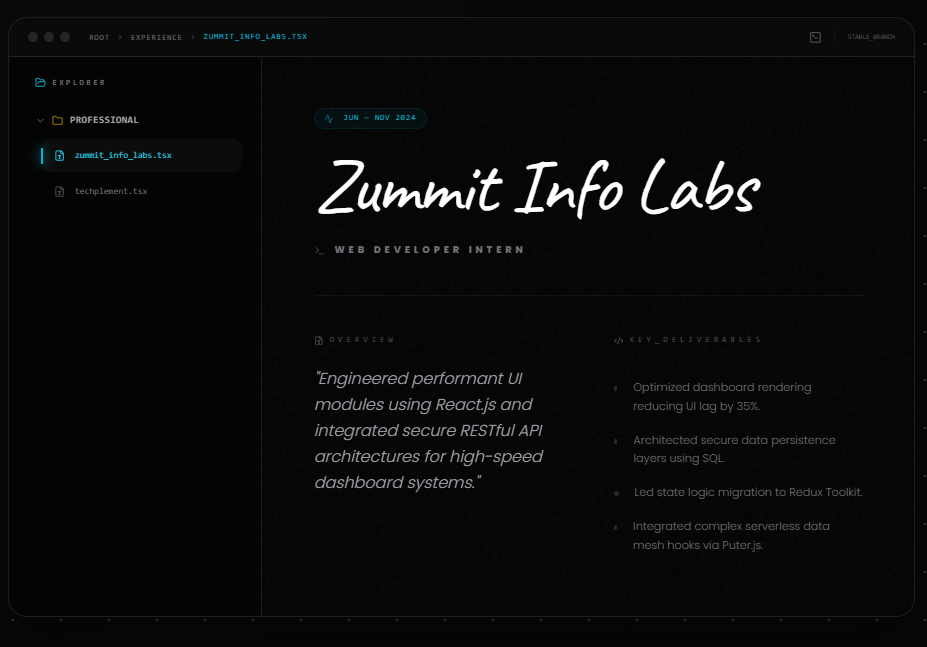
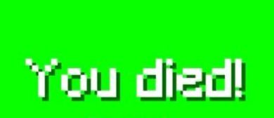

# React + Vite

This template provides a minimal setup to get React working in Vite with HMR and some ESLint rules.

Currently, two official plugins are available:

- [@vitejs/plugin-react](https://github.com/vitejs/vite-plugin-react/blob/main/packages/plugin-react) uses [Babel](https://babeljs.io/) (or [oxc](https://oxc.rs) when used in [rolldown-vite](https://vite.dev/guide/rolldown)) for Fast Refresh
- [@vitejs/plugin-react-swc](https://github.com/vitejs/vite-plugin-react/blob/main/packages/plugin-react-swc) uses [SWC](https://swc.rs/) for Fast Refresh

## React Compiler

The React Compiler is not enabled on this template because of its impact on dev & build performances. To add it, see [this documentation](https://react.dev/learn/react-compiler/installation).

## Expanding the ESLint configuration

If you are developing a production application, we recommend using TypeScript with type-aware lint rules enabled. Check out the [TS template](https://github.com/vitejs/vite/tree/main/packages/create-vite/template-react-ts) for information on how to integrate TypeScript and [`typescript-eslint`](https://typescript-eslint.io) in your project.

work exp

1) The "Interactive Stack Trace"
Instead of a timeline, display your career as a "Stack Trace" from an error console, but stylized for a premium SaaS.

The UI: A vertical list of "frames." Each frame is an experience.

The Design: Use a mono-font for headers (e.g., at Techplement.build()).

The "Deep Dive": Each entry has a clickable [expand] button. When clicked, it uses a Shadcn Collapsible to reveal a "Log" of your achievements.

The Creative Detail: Use Aceternity's "Sparkles" or "Vortex" effect inside the expanded log area to make the data feel "energized" and modern. 
but it should display with non collapsible 

final prompt for interactive stack trace: 

To implement the Interactive Stack Trace design, we will lean into a "Developer Console" aesthetic but elevated with premium SaaS styling. This design focuses on a vertical, logical flow that looks like a high-end debugging tool.

The "Interactive Stack Trace" UI Design
1. Structural Layout (The "Console" Window)
Container: A large, dark-themed container with a bg-zinc-950 base and a border-slate-800 finish. Use a very large rounded-[2.5rem] to keep it feeling modern rather than "boxy."

Header: A minimal "tab bar" at the top of the container with three colored circles (Mac-style) and a centered title like system_logs.sh.

The List: A single vertical column where each "frame" is a career milestone.

2. Component Breakdown
The Frame (Experience Card): * The Call: Use a monospace font for the "function call" style header: at ZummitInfoLabs.optimize(Dashboard).

The Log Level: A small colored tag (Shadcn Badge) that changes color based on the job: [SUCCESS] for completed internships or [ACTIVE] for current roles.

The Metadata: A subtle gray timestamp on the far right (e.g., 2ms ago or Jun — Nov 2024).

The Trace Line: A thin, glowing vertical line (bg-gradient-to-b from-blue-500 to-transparent) that connects the "frames."

3. Interactions & Motion Patterns
Expansion (Shadcn Collapsible): When the user clicks a frame, it doesn't just open; it "executes." The card expands vertically, and the technical achievements appear line-by-line as if they are being printed to a terminal.

Aceternity "Vortex" Background: Inside the expanded content area, add a very low-opacity Vortex or Sparkles effect. This makes the text feel like it’s floating in a high-tech environment.

Hover Elevation: On hover, the specific "frame" should have a soft cyan outer glow and the mono-text should slightly shift to the right (transition-transform duration-300).

Why this Design Wins
Professional Identity: It immediately tells a recruiter you are a developer. It speaks the language of the tools they see every day.

Clarity: By keeping details hidden until clicked, the UI remains incredibly clean and minimal, which is a core principle of Shadcn and Aceternity layouts.

Storytelling: It treats your experience as a sequence of successful operations rather than a static list of duties.

Implementation Recipe (Tailwind + React)
Text Glow: text-cyan-400 drop-shadow-[0_0_8px_rgba(34,211,238,0.8)]

Vertical Connector: before:absolute before:left-4 before:top-0 before:h-full before:w-[1px] before:bg-zinc-800

Expanding Animation: Use Fram

The "Kernel Explorer" Interface
 The "Shell" Container

Structure: Use a large-radius (24px) glassmorphic container with a 0.5px stroke of white/10.

Header: A clean, fixed bar at the top containing three "window controls" (muted gray circles) and a Shadcn Breadcrumb that displays the active path: root > experience > zummit.tsx.

Background: Use a subtle noise texture over a deep #050505 background to match your current landing page.

The "Explorer" Sidebar (Left 30%)

Logic: A minimalist vertical list using Geist Mono typography.

Navigation: Folders and files representing your history:

📁 Professional_History

📄 zummit_info_labs.ts

📄 techplement.json

Active State: The selected "file" should have a subtle Aceternity "Background Beams" glow or a simple left-border accent in a muted primary color.
